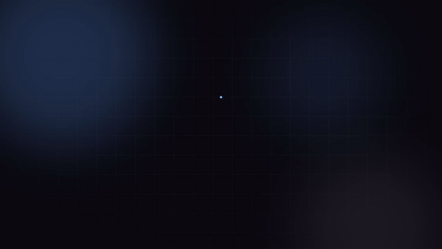

# Talk to Your Video

Ask natural-language questions about a video and get back answers grounded with exact timestamps — about what's **said** and what's **shown**. Upload a video, it's transcribed *and* visually analyzed frame-by-frame, both feed the same knowledge graph, and a LangGraph agent answers your questions by querying it. Because it understands the video visually, it still works on clips with little or no narration — not just a transcript-Q&A tool.



*Preview above; full ~26s video (concept, pipeline, knowledge graph, chat) at [`docs/media/promo.mp4`](docs/media/promo.mp4), rendered programmatically with [Remotion](https://www.remotion.dev) — source in [`promo/`](promo/).*

- **Grounded, not generic** — every answer cites the exact timestamp(s) it came from.
- **Sees, not just hears** — frame-level vision analysis means silent/low-narration clips still work.
- **Fully local** — Whisper, Ollama, and Neo4j all run on your own machine; no external API costs.
- **One knowledge graph** — transcript and visual entities merge into the same Neo4j graph, queryable together.

## Architecture

```
┌─────────────┐   upload / query / status / segments / SSE progress   ┌─────────────┐
│  React SPA  │ ─────────────────────────────────────────────────────►│   FastAPI   │
└─────────────┘                                                       └──────┬──────┘
                                                                      enqueue │  ▲
                                                                              ▼  │ query (sync)
                                                                       ┌─────────────┐
                                                                       │   Celery    │
                                                                       │   worker    │
                                                                       └──────┬──────┘
      Per ~8s window, spanning the WHOLE video (not just speech):            │
      1. ffmpeg extract audio (or None if no audio track)                   │
      2. faster-whisper transcribe                                          │
      3. ffmpeg grab a frame -> Ollama moondream describes it                │
      4. Ollama llama3.1:8b entity/topic extraction (transcript + visual)    │
      5. embed the combined transcript+visual text (nomic-embed-text)        │
                                                                              ▼
┌────────────────────────────────────────────────────────────────────────────┐
│                                    Neo4j                                   │
│   (:Video)-[:HAS_SEGMENT]->(:Segment {text, visual_description, embedding})│
│   (:Segment)-[:MENTIONS]->(:Entity|:Topic)   + native vector index         │
└──────────────────────────────────────┬─────────────────────────────────────┘
                                        │ Cypher + vector search
                                 ┌─────────────┐
                                 │  LangGraph  │  router -> cypher_tool + vector_search_tool
                                 │    agent    │  (parallel on hybrid) -> synthesize
                                 └─────────────┘  (traced via LangSmith)
```

Redis is the Celery broker/result backend (not pictured above). FastAPI calls the LangGraph agent directly (synchronously) for `/query` — no queueing needed since it only takes seconds.

## Tech stack

- **API:** FastAPI
- **Async ingestion:** Celery + Redis
- **Transcription:** faster-whisper
- **Vision:** Ollama `moondream` (per-segment frame analysis — objects/actions on screen, not just speech)
- **Knowledge graph:** Neo4j (graph relations + native vector index for semantic search)
- **Agent orchestration:** LangGraph
- **LLM/embeddings:** Ollama, self-hosted (`llama3.1:8b` + `moondream` + `nomic-embed-text`) — no external API costs
- **Frontend:** React + Vite + Tailwind
- **Tracing:** LangSmith
- **Deployment:** Kubernetes (Kind) via Helm, NGINX ingress
- **Observability:** Prometheus + Grafana
- **CI/CD:** GitHub Actions

## Project structure

The core pipeline logic is an installable library (`talk_to_your_video/`), independent of any web framework or task queue. `app/` and `worker/` are thin services that import from it — either can be swapped or reused elsewhere without dragging the other along.

```
talk_to_your_video/   Installable library — the reusable core (pip install -e . pulls in just this)
  config.py             Settings + lazy get_settings() (no import-time side effects)
  models.py             Shared Pydantic models (Segment, SegmentDetail, Citation, QueryResponse, VideoStatus)
  ingestion/            Ingestion steps + run_pipeline() orchestration: audio extraction, transcription,
                         fixed-window segmentation, frame extraction + vision analysis (moondream),
                         entity/topic extraction (transcript + visual, merged), embeddings, graph write
  agent/                LangGraph agent (router, Cypher tool, vector search tool, synthesis)
  graph/                Neo4j driver client, video status tracking, segment listing, Cypher migrations

app/       FastAPI service — upload/status/segments/events(SSE)/query/health, calls into talk_to_your_video
worker/    Celery worker — wraps talk_to_your_video.ingestion.run_pipeline() as a task
frontend/  React + Vite + Tailwind SPA — upload, live progress, segment timeline, knowledge graph, chatbot
promo/     Remotion project — programmatic promo video (see promo/README.md)
charts/    Helm chart for Kubernetes deployment
scripts/   Dev/deploy helper scripts
tests/     Unit and integration tests
docs/      Implementation plan (PLAN.md), phase progress checklist (PROGRESS.md), demo media
```

Installing just the core (no FastAPI/Celery): `pip install .` gives you `agent`, `graph`, and `ingestion`. Add `.[api]` and/or `.[worker]` extras for the FastAPI/Celery pieces.

## Local development

```bash
uv sync --all-extras
cp .env.example .env
docker compose up -d
```

Then:

```bash
curl -F file=@tests/fixtures/sample.mp4 -F title="My Video" localhost:8000/videos
curl localhost:8000/videos/<video_id>/status
curl localhost:8000/videos/<video_id>/segments
curl -N localhost:8000/videos/<video_id>/events   # SSE progress stream
curl -X POST localhost:8000/query \
  -H "Content-Type: application/json" \
  -d '{"video_id": "<video_id>", "question": "What does the speaker say about X?"}'
```

Neo4j Browser is available at `localhost:7474` to inspect the graph directly.

Frontend dev server (separate terminal):

```bash
cd frontend
npm install
npm run dev
```

Vite's dev server proxies `/api/*` to the FastAPI backend on `localhost:8000` — see `frontend/vite.config.ts`.

Verified end-to-end (upload → transcribe → visual analysis → graph write → query → chat) against a live Docker Compose stack, via both `curl` and the browser UI.

## Kubernetes deployment

```bash
kind create cluster
helm install ingress-nginx ingress-nginx/ingress-nginx --namespace ingress-nginx --create-namespace
helm install ttyv charts/talk-to-your-video
```

> Helm chart contents land in a later build phase — see `docs/PROGRESS.md` for current status.

## Status

This project is under active build-out. See [`docs/PLAN.md`](docs/PLAN.md) for the full phased implementation plan and [`docs/PROGRESS.md`](docs/PROGRESS.md) for what's done so far.

## License

All rights reserved. This repository is public for portfolio/demonstration purposes only — see [`LICENSE`](LICENSE). No permission is granted to copy, modify, or reuse this code.
